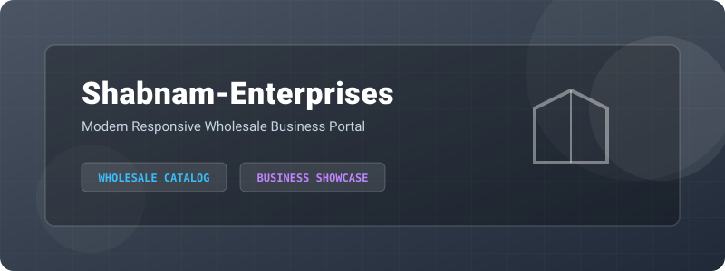
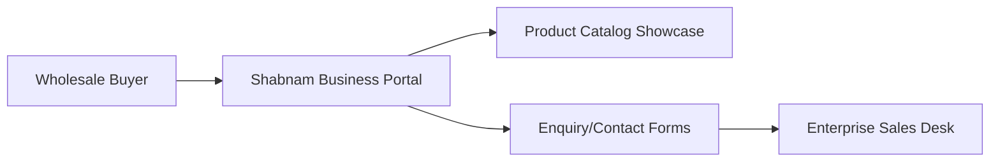

<!-- ========== NEW: ANIMATED WAVE HEADER ========== -->
<!-- ========== NEW: TYPING ANIMATION INTRO ========== -->
<p align="center">
  
</p>

<!-- ========== NEW: HIGH QUALITY PROJECT BANNER ========== -->
<p align="center">
  
</p>


<!-- ========== NEW: AUTHOR & ARCHITECT SECTION ========== -->
## 👨‍💻 Author & Architect

<table>
<tr>
<td align="center" width="160">
  <a href="https://github.com/Sadique721">
    <br>
    <b>Md Sadique Amin</b><br>
    <sub>Backend Java Developer</sub>
  </a>
</td>
<td>

**Md Sadique Amin** — Backend Java Developer.

- 🔗 GitHub: [@Sadique721](https://github.com/Sadique721)
- 📧 Email: mdsadiqueamin721786@gmail.com
- 🏗️ Built: Enterprise BSS-OSS Telecom Suite, Backend Java Developer, IR Interconnect & Roaming

</td>
</tr>
</table>

<!-- ========== NEW: SYSTEM DIAGRAM SECTION ========== -->
## 📊 System Architecture & Workflow



---

# 🏆 SHABNAM ENTERPRISES — Industrial Contracting & Workforce Solutions


> **SHABNAM ENTERPRISES** is a premium, state-of-the-art industrial contracting and workforce solutions platform offering professional insulation work, mechanical work, anti-corrosive painting, roof sheeting, and passenger lift installations since 1999.

Designed and engineered with a modern responsive corporate layout, customizable Dark/Light mode theme, and an interactive **360-degree rotating 3D industrial components viewer** powered by Three.js.

---

## 👨‍💻 Owner & Creator
**Md Sadique Amin**  
*Software Engineer & Tech Creator*  
📍 Ahmedabad, Gujarat, India  
📧 [mdsadiqueamin721786@gmail.com](mailto:mdsadiqueamin721786@gmail.com)  
🔗 [Instagram](https://instagram.com/mdsadiqueamin) | [LinkedIn](https://linkedin.com/in/mdsadiqueamin) | [YouTube](https://youtube.com/@mdsadiqueamin721)

---

## ✨ Features (100% Implemented)

| Feature | Description |
|---------|-------------|
| 🧊 **3D Product Showcase** | WebGL canvas viewport displaying 3D models of 15 industrial components (insulated pipe, PUF panel, lift cabin, scaffolding coupler, water tube bundle, sprinkler, cable tray, roof deck, spray gun, exhaust fan, cold room, sliding gate, sandblasting nozzle, acoustic panel, and AHU) with 360-degree rotation, auto-rotation, wireframe toggles, light adjustments, and dynamic specifications. |
| 🎛️ **Dual-Mode Theme** | Fully integrated Dark/Light mode theme support with preference saving in browser localStorage. |
| 📊 **Client Workspace** | Online estimate calculator for manpower and structural tasks + active project status timeline tracker. |
| 🗃️ **Multi-Image Carousel** | Service cards utilizing Swiper slider layouts showing multiple detailed project gallery photos. |
| 📑 **Compliance Center** | Clickable statutory certificates verification board for PAN, GST, EPF, and ESIC. |

---

## 📁 Project Structure

```bash
Shabnam-Enterprises/
├── index.html        # Main web app layout containing CSS/JS code
├── note.txt          # Modernization summary and deployment details
├── README.md         # Project documentation and developer profile
└── .gitignore        # Git ignores configuration
```

---

## 🚀 How to Run Locally

1. Clone this repository to your local system:
   ```bash
   git clone https://github.com/Sadique721/Shabnam-Enterprises.git
   ```
2. Navigate into the project folder:
   ```bash
   cd Shabnam-Enterprises
   ```
3. Open `index.html` in your default web browser (or serve it with Live Server extension in VS Code):
   ```bash
   start index.html
   ```

---

## 📄 License

This project is licensed under the MIT License - see the [LICENSE](LICENSE) file for details.

## 🤝 Contributing

Contributions, issues, and feature requests are welcome! Feel free to check the [issues page](https://github.com/Sadique721/Shabnam-Enterprises/issues).

---

<p align="center">Made with ❤️ by <a href="https://github.com/Sadique721">Md Sadique Amin</a></p>


<!-- ========== NEW: FOOTER WAVE ANIMATION ========== -->
<p align="center">
  
</p>